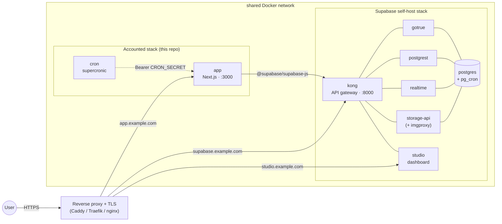

# Self-Hosting Accounted

This guide walks you through deploying Accounted on your own infrastructure using Docker.

## Prerequisites

- Docker and Docker Compose v2+
- A Supabase project (free tier works: create one at [supabase.com](https://supabase.com))

## 1. Create a Supabase Project

1. Go to [supabase.com](https://supabase.com) and create a new project.
2. Note these values from **Settings > API**:
   - `Project URL` (e.g., `https://abcdefgh.supabase.co`)
   - `anon` public key
   - `service_role` secret key

## 2. Configure Supabase Auth

In the Supabase dashboard under **Authentication > URL Configuration**:

1. Set **Site URL** to your deployment URL (e.g., `https://gnubok.example.com`).
2. Add `https://gnubok.example.com/auth/callback` to the **Redirect URLs** allowlist.

Accounted uses email + password authentication with magic link as a fallback. The default Supabase email auth settings work out of the box. For production, configure a custom SMTP provider under **Authentication > SMTP Settings** to avoid Supabase's built-in rate limits. Keep **Secure email change** enabled (Authentication > Settings, on by default): a login-email change also removes social logins tied to the old address, so the old mailbox must confirm the change before it can lose its access.

MFA (two-factor authentication via TOTP) is **not enforced** for self-hosted deployments: the Docker image sets `NEXT_PUBLIC_SELF_HOSTED=true` by default, which disables MFA enforcement. Users can still optionally enable 2FA in Settings > Säkerhet if they wish. Idle and absolute session timeouts are also off by default for self-hosted installs; operators can opt in with the variables below.

## 3. Apply Database Migrations

The `supabase/migrations/` directory contains the ordered SQL files that set up the full schema, including tables, RLS policies, triggers, and functions.

**Option A: Supabase CLI (recommended):**

```bash
# Install the Supabase CLI
npm install -g supabase

# Link to your project
supabase link --project-ref <your-project-ref>

# Push all migrations
supabase db push
```

**Option B: SQL Editor:**

Run each file in `supabase/migrations/` in order in the Supabase SQL Editor. They must be applied sequentially: later migrations depend on earlier ones.

### PostgreSQL Extensions

The migrations automatically enable these extensions:

| Extension | Migration | Purpose |
|-----------|-----------|---------|
| `uuid-ossp` | 001 | UUID generation |
| `vector` (pgvector) | 033 | Created by an early migration; no current code path stores embeddings, the extension only needs to exist for the migration to apply |
| `btree_gist` | 042 | Fiscal period overlap prevention |
| `pg_cron` | 048 | In-database scheduled jobs |

These are all available on Supabase hosted. `pg_cron` requires a paid plan: if you are on the free tier, migration 048 will fail. You can safely skip it; the cron sidecar container handles the equivalent job via HTTP instead.

## 4. Configure Environment

**Option A: Setup script (recommended):**

```bash
git clone https://github.com/erp-mafia/accounted.git
cd accounted
./setup.sh
```

The script checks prerequisites, prompts for your Supabase credentials, auto-generates `CRON_SECRET`, and writes everything to `.env`.

**Option B: Manual:**

```bash
git clone https://github.com/erp-mafia/accounted.git
cd accounted
cp .env.docker.example .env
```

Edit `.env` with your values:

```bash
# ─── Required ───
NEXT_PUBLIC_SUPABASE_URL=https://your-project.supabase.co
NEXT_PUBLIC_SUPABASE_ANON_KEY=your-anon-key
SUPABASE_SERVICE_ROLE_KEY=your-service-role-key
NEXT_PUBLIC_APP_URL=https://your-domain.com
CRON_SECRET=<generate with: openssl rand -hex 32>
```

`NEXT_PUBLIC_APP_URL` must match your public-facing URL. It is used in invoice reminder emails, calendar feed links, and PSD2 callbacks. If left as a placeholder, links will be broken.

Automatic logout is opt-in per user: sessions only expire for users who have
enabled "Automatic logout" in Settings > Security (stored on
`user_preferences.auto_logout`, default off). For opted-in users, hosted
Accounted defaults to a 30-minute idle limit, a 12-hour absolute limit, and a
warning 2 minutes before expiry. Self-hosted installations leave both limits
disabled unless you opt in (values are milliseconds):

```bash
NEXT_PUBLIC_SESSION_IDLE_TIMEOUT_MS=1800000
NEXT_PUBLIC_SESSION_ABSOLUTE_TIMEOUT_MS=43200000
NEXT_PUBLIC_SESSION_WARNING_MS=120000
```

Set either timeout to `0` to disable only that limit. To enforce the timeouts
for every user regardless of their per-user preference (the pre-2026-08
behavior), also set:

```bash
NEXT_PUBLIC_SESSION_TIMEOUT_FORCE_ALL=true
```

Timeout state is signed
with `SUPABASE_SERVICE_ROLE_KEY` by default; set `SESSION_TIMEOUT_SECRET` to a
separate random value if you want to rotate it independently. Changing either
signing secret invalidates existing timeout cookies and requires users to sign
in again.

Two legal forms are still in beta and are not offered in onboarding unless you
switch them on. The database accepts both regardless, so no migration is
involved, and the image carries a placeholder for each flag: the entrypoint
substitutes your value at container start, so a restart is enough.

```bash
NEXT_PUBLIC_IDEELL_FORENING_ENABLED=true
NEXT_PUBLIC_HANDELSBOLAG_ENABLED=true
```

## 5. Start the Application

```bash
docker compose up -d
```

This starts two containers:

| Container | Purpose |
|-----------|---------|
| `app` | Next.js application (`ghcr.io/erp-mafia/gnubok:latest`) |
| `cron` | Scheduled jobs via [supercronic](https://github.com/aptible/supercronic) |

The cron container waits for the app health check to pass before starting.

Verify the deployment:

```bash
curl http://localhost:3000/api/health
# {"status":"healthy","timestamp":"...","version":"1.0.0"}
# `version` is the build commit SHA prefix when VERCEL_GIT_COMMIT_SHA or
# NEXT_PUBLIC_BUILD_ID was set at build time, otherwise "1.0.0".
```

> **Note:** The health check queries the database, so migrations must be applied before it returns healthy.

### Building from Source

To build the Docker image locally instead of pulling from GHCR:

```bash
docker compose -f docker-compose.yml -f docker-compose.build.yml up --build
```

The locally-built image runs **unprivileged** (`USER nextjs`): the entrypoint
populates the `.next`/`public` tmpfs mounts and substitutes the `NEXT_PUBLIC_*`
placeholders as the `nextjs` user, so the container needs no Linux capabilities
and runs as-is under the hardened compose defaults (`cap_drop: ALL`,
`read_only: true`).

### Custom Port

Set `PORT` in your `.env` or environment to change the host port (the container always listens on 3000 internally):

```bash
PORT=8080 docker compose up -d
```

## 6. First Login

1. Open your deployment URL in a browser.
2. Click "Skapa konto" (Create account) and register with email + password.
3. Check your email and click the confirmation link.
4. Complete the 5-step onboarding wizard:
   - **Step 1**: Choose entity type (enskild firma or aktiebolag)
   - **Step 2**: Company name and org number
   - **Step 3**: Fiscal year, VAT registration, accounting method
   - **Step 4**: Preliminary tax amount (optional, skip if unsure)
   - **Step 5**: Bank details for invoices (optional)

There is no admin account: any email address can sign up (unless you turn public signup off, see the `AUTH_SIGNUPS_DISABLED` note under [Email](#email-invoice-sending-invitations-and-reminders)). You can also use the magic link option on the login page if preferred.

To bring in more users, invite them from **Settings > Company > Members** (company-scoped) or **Settings > Team** (consultant teams). Invitations work without a mail provider: the accept link is returned to the inviter right after the invite is created (shown under the pending list with a copy button), so it can be shared over any channel. Configuring Resend only adds automatic delivery. The link is shown once and cannot be re-sent for company invites: revoke the invitation and invite again to get a fresh link.

## Scheduled Jobs

The cron sidecar runs the schedule in [`docker/crontab.self-hosted`](../docker/crontab.self-hosted). That file is generated from the `crons` array in `vercel.json` (the single source of truth, shared with the hosted service) by `npm run crontabs:generate`, and a test fails CI if it drifts, so this guide does not repeat the table: open the file for the exact jobs and times. They fall into these groups:

- **Every minute / every few minutes**: webhook dispatch, WhatsApp and invoice-inbox sweeps (crash recovery for staged uploads).
- **Hourly**: recurring invoices, cloud-backup auto-sync, idempotency-key cleanup.
- **Nightly (UTC)**: deadline statuses, tax deadlines, document-archive SHA-256 verification, event and pending-operation cleanup, sandbox cleanup, booking-template sync, bank sync, skattekonto sync, accrual posting, receipt hunt, WhatsApp retention.
- **Skatteverket receipts**: AGI every 15 minutes, VAT every two hours.

Extension endpoints are listed unconditionally: one whose extension is not enabled answers a cheap no-op, so enabling it later needs no crontab change.

All cron endpoints are authenticated with `Authorization: Bearer <CRON_SECRET>`. The cron container calls the app over the internal Docker network (`http://app:3000`), so these endpoints are not exposed publicly.

Additionally, migration 048 schedules a `pg_cron` job inside the database that marks overdue supplier invoices daily at 06:00 UTC.

## Optional Features

### AI Features

All AI features (automatic interpretation of uploaded receipts and invoices via the `document-extraction` and `invoice-inbox` extensions, and the in-app AI assistant) run on one configured backend. There are three ways to provide one; pick one. Note that the agent surface most integrations use, the MCP server, needs no AI backend at all: it is your own agent (Claude, Codex, a local model) talking to the ledger, so a deployment without any of the credentials below is still fully usable that way.

The stock self-hosted image includes both extraction extensions, so these credentials cover emailed invoices and documents uploaded in the app.

**Option 1: the direct Anthropic API.** The simplest option for self-hosting, since it needs nothing but a key from [console.anthropic.com](https://console.anthropic.com). Billing is your own, separate from any Claude subscription.

```bash
ANTHROPIC_API_KEY=sk-ant-...
```

**Option 2: AWS Bedrock.** Requires an AWS account with Bedrock model access to Claude. This is what the hosted service runs, because it keeps inference inside the EU (the `eu.` cross-region inference profile; `AWS_REGION` is the API endpoint, not a pin to one region): choose it if you need the AI calls to stay in the EU, which the direct API does not guarantee.

```bash
AWS_ACCESS_KEY_ID=...
AWS_SECRET_ACCESS_KEY=...
AWS_REGION=eu-north-1   # default
```

Set both static AWS keys explicitly. The AI assistant's client can fall back to the standard AWS credential provider chain (instance profile, IRSA) when they are absent, but document extraction requires `AWS_ACCESS_KEY_ID` and `AWS_SECRET_ACCESS_KEY` and silently returns empty results without them.

**Option 3: any OpenAI-compatible endpoint.** Any server that implements the chat-completions API: a Swedish inference provider for a fully sovereign deployment, or a **local model** on the same machine (llama.cpp's `server`, Ollama's `/v1`, LM Studio, vLLM). Document extraction (receipts, invoices, HTML mail invoices), the assistant's question-and-answer (on both `/chat` and the docked assistant sheet, via `/api/agent/ask`), and one-tap transaction categorization run here on any provider. A set of specialized conversational flows still needs an Anthropic-family backend; see **What runs on any model** below.

```bash
AI_BASE_URL=http://localhost:11434/v1   # the endpoint's OpenAI-compatible base URL (here: a local Ollama)
AI_MODEL=qwen3.8                        # a model id is required: there is no default for an arbitrary endpoint
# AI_API_KEY=...                        # OPTIONAL: only when the endpoint needs auth. A local server usually
#                                       #   has none, so leave it unset; a hosted provider gives you a key.
# AI_EXTRACTION_MODEL=...               # optional: a vision model for document reading, if AI_MODEL is not one
```

Three things about such endpoints are declared rather than probed, because the app cannot tell from the outside:

- `AI_VISION=false` says the configured model cannot read images. Images and PDFs are then skipped honestly (the inbox row lands with the empty skeleton and the "AI-tolkning kördes inte" hint) instead of failing with a 400 on every upload; HTML mail invoices still extract as text on any model.
- `AI_PDF_MODE` defaults to `rasterize` here: most such endpoints have no PDF input, so the first `AI_PDF_MAX_PAGES` pages (default 4) are rendered to images with poppler's `pdftoppm`, which the self-host image installs (`apk add poppler-utils`, the only system package beyond the base image; page images are written to `/tmp`, a tmpfs in `docker-compose.yml`). If the binary is missing, PDFs are skipped with `pdf_rasterizer_missing` rather than failing; `AI_PDF_RASTERIZER_BIN` points at a non-standard install. A provider that accepts the OpenAI `file` content part can use `AI_PDF_MODE=native`.
- `AI_STRICT_JSON=true` asks for `response_format: json_schema` on providers that enforce it. The default (JSON answered in prose, then parsed and validated) works on every model and is what hosted runs.

#### What runs on any model

Most AI surfaces run on any of the three backends above, an OpenAI-compatible or local model included:

- **Document extraction**: receipts, invoices, and HTML mail invoices.
- **The AI assistant's question-and-answer**, on both `/chat` and the docked assistant sheet (`/api/agent/ask`), including its read-only ledger tools.
- **One-tap transaction categorization** (`/api/agent/categorize`): the deterministic-candidates then model-select cascade shown on the transactions page.

A few **specialized conversational flows** still run on the older streaming runtime (`/api/agent/invoke`), which requires an Anthropic-family model (AWS Bedrock or the direct Anthropic API). On an OpenAI-compatible or local backend these specific actions return `503`; everything above keeps working. They are:

- **Operation-staging flows** (they draft a change for you to approve): the invoice-inbox "Fraga assistenten" categorize, bulk-book, invoice draft, supplier-invoice review, and verifikat draft.
- **Context-bound assistant helpers**: VAT review, KPI explanation, settings help, the bokslut step-through, and onboarding.

Migrating these to the single-call surface, so a fully local deployment covers them too, is tracked in [#1800](https://github.com/erp-mafia/accounted/issues/1800).

Optional model overrides, in any setup:

```bash
AI_MODEL=...                             # default model for every tier (OpenAI-compatible: required)
AI_EXTRACTION_MODEL=...                  # document extraction model
AI_HEAVY_MODEL=...                       # assistant model, heavy intents
AI_ASSISTANT_MODEL=...                   # assistant model, standard intents
AI_EXTRACTION_MAX_TOKENS=8192            # output cap for document extraction
AI_PROVIDER=bedrock|anthropic|openai-compatible   # force the backend (see below)
```

The pre-existing names `BEDROCK_MODEL_ID`, `BEDROCK_OPUS_MODEL_ID`, `BEDROCK_SONNET_MODEL_ID` and `BEDROCK_MAX_TOKENS` keep working as the same overrides (extraction, heavy, standard, extraction cap) on every backend; the `AI_*` names take precedence when both are set. Claude deployments default every tier to `claude-sonnet-5`.

When several credential sets are present, Bedrock wins, then the direct Anthropic API, then the OpenAI-compatible endpoint, so that adding a key for an experiment cannot silently move production inference out of the EU. Set `AI_PROVIDER` to say which you mean. A model id written without a provider prefix is adapted to whichever backend is active; an id that already carries one (`eu.anthropic.…`) is used as-is.

Without working credentials the rest of the app runs normally: uploads are stored but not auto-interpreted (the upload UI sees that immediately rather than waiting for a timeout), and the AI assistant answers `503 ai_unconfigured`.

#### Verifying the setup

`scripts/smoke-ai-provider.ts` is the "is AI wired up?" command. It works the same on every backend because it only talks to the app's AI service: it prints the resolved provider, the model per tier, the PDF mode (and whether `pdftoppm` is installed when PDFs are rasterized), then sends real traffic: one small text generation per tier model, one schema-shaped answer, and, when you pass a file, the exact document-extraction path an uploaded receipt takes. It exits non-zero if any step fails, so it works as a post-deploy check. Run it from a checkout next to the env file your deployment uses (`.env.local`, then `.env` are read):

```bash
npx tsx scripts/smoke-ai-provider.ts                 # provider, models, text + structured calls
npx tsx scripts/smoke-ai-provider.ts ./receipt.pdf   # also runs document extraction end to end
```

A skipped extraction is reported as a failure with the reason: a text-only model (`ai_no_vision`, pick a vision model for `AI_EXTRACTION_MODEL`), a missing rasterizer (`pdf_rasterizer_missing`, install poppler-utils or set `AI_PDF_MODE=native`), or no credentials/model at all.

On the Anthropic family, `scripts/smoke-ai.ts` additionally probes the in-app assistant's full parameter set (a streamed turn with a tool, adaptive thinking, effort and the prompt cache), which the assistant still sends through the Anthropic SDK directly:

```bash
npx tsx scripts/smoke-ai.ts                  # credentials, models, chat loop
# Note: this check only detects static credentials (ANTHROPIC_API_KEY or
# AWS_ACCESS_KEY_ID/AWS_SECRET_ACCESS_KEY). Bedrock deployments using an
# instance profile or IRSA won't be picked up automatically: set
# AI_PROVIDER=bedrock to run the probes against the AWS credential chain
# anyway.
npx tsx scripts/smoke-ai.ts ./receipt.pdf    # also runs document extraction
```

> **Note:** `OPENAI_API_KEY` from earlier versions is not read by any code path. To use OpenAI itself, point Option 3 at `https://api.openai.com/v1`; the app has no provider-specific OpenAI integration, only the OpenAI-compatible one. Background: [#1406](https://github.com/erp-mafia/accounted/issues/1406).

### Email (Invoice Sending, Invitations and Reminders)

Outbound mail (invoices, reminders, payslips) goes through one of two providers. Auth/account mail is sent by Supabase Auth and is not affected.

**Option 1: Resend** (what hosted runs):

```bash
RESEND_API_KEY=re_...
RESEND_FROM_EMAIL=noreply@your-domain.com
```

Requires a [Resend](https://resend.com) account with a verified sender domain.

**Option 2: your own SMTP relay** (a Swedish mail provider, a Microsoft 365 / Google Workspace relay, Postfix on the host):

```bash
EMAIL_PROVIDER=smtp
SMTP_HOST=smtp.example.se
SMTP_PORT=587                         # default 587; 465 with SMTP_SECURE=true
SMTP_SECURE=false                     # true = implicit TLS, false = STARTTLS required (set SMTP_REQUIRE_TLS=false only for a plaintext LAN relay)
SMTP_USER=...                         # optional for an internal relay
SMTP_PASS=...
SMTP_FROM_EMAIL=faktura@your-domain.se
# SMTP_REQUIRE_TLS=false              # only for a plaintext relay on a trusted LAN: without it a relay that cannot STARTTLS fails the send instead of leaking credentials and invoice PDFs in cleartext
# SMTP_TLS_REJECT_UNAUTHORIZED=false  # only for a LAN relay with a self-signed certificate
```

`EMAIL_PROVIDER` is optional: with a `RESEND_API_KEY` present Resend is used, otherwise `SMTP_HOST` selects SMTP, so adding SMTP variables next to an existing Resend key never moves mail by accident. Set it explicitly when both are configured. The From header is built identically on both providers (the company or brand name as display name, the platform address from `RESEND_FROM_EMAIL` or `SMTP_FROM_EMAIL` unless the company has a verified sending domain); the delivery-status webhook is Resend-only.

Without either, invoices can still be generated as PDFs but cannot be emailed.

**Invitations do not require Resend.** When no mail provider is configured, the invite is still created and the accept link is returned to the inviter in the app (a copy button under the pending invitations list, plus a warn-level log record whose msg is `email service not configured: invite email skipped`; the Docker image logs JSON, so grep for the message text, not a `WARN` prefix; the token is never logged). Share the link manually; it is valid until the invitation expires. A mail provider (Resend, or your own relay with `EMAIL_PROVIDER=smtp`, both above) is only needed if you want the invitation mailed automatically. There is no re-send for company invitations: revoke and invite again for a new link.

Note the two separate mail paths: this variable drives the app's own mail (invoices, invitations, reminders); account mail from GoTrue (signup confirmation, password reset, and the account-provisioning invite when `AUTH_SIGNUPS_DISABLED=true`) goes through the Supabase **Authentication > SMTP Settings** described in [Configure Authentication](#2-configure-supabase-auth) and [Troubleshooting](#troubleshooting).

```bash
AUTH_SIGNUPS_DISABLED=true
```

Set this when you have turned public signup off in GoTrue (`disable_signup`). The invite route then provisions the invitee's account through the auth admin API before writing the invitation, and GoTrue mails its own set-password link via the Supabase SMTP settings; the in-app accept link is still returned to the inviter.

### Connector subscription (self-hosted instances)

Everything a self-hosted instance runs itself is free (AGPL). Five capabilities depend on services only Accounted operates and are therefore gated on a self-host: bank sync (our PSD2/AISP credentials), Skatteverket API submission and skattekonto sync (our API client registration), Peppol e-invoicing (our contracted access point), company lookup (TIC) and migration from Fortnox/Visma/Bokio/Björn Lundén (the migration gateway). A **connector key** unlocks them for every company on the instance; it is priced per active company at parity with hosted and will be issued manually by Accounted (self-serve later); no keys are issued until the instance-side client wiring described below is complete.

```bash
GNUBOK_CONNECTOR_KEY=gnubok_ck_...            # issued by Accounted, shown once
# GNUBOK_CONNECT_URL=https://connect.accounted.se   # default: the connector service
```

The cron sidecar calls `/api/connector/sync/cron` hourly (it is listed in `docker/crontab.self-hosted` only): the instance reports its active company count, the hosted service answers with the key's status and scopes, and the instance writes `capability_grants` rows with `source = 'connector'` that expire after **72 hours** (or three days past the paid period, whichever is sooner). Those rows are the offline cache: a hosted outage shorter than that changes nothing, a revoked or lapsed key freezes the connector capabilities within days, and nothing in the instance phones home for permission to run the bookkeeping. An instance without a key answers `not_configured` and stays unaffected. To run the sync once by hand after pasting the key:

```bash
curl -sf -H "Authorization: Bearer $CRON_SECRET" http://localhost:3000/api/connector/sync/cron
```

The **bank** and **Skatteverket** connector proxies are live on the connector service (`connect.accounted.se/api/connect/bank/*` and `/api/connect/skv/*`): with `bank_sync` / `skatteverket` in your key's scopes, the instance connects a bank through Arcim's PSD2 credentials and files VAT/AGI + syncs skattekonto through Arcim's registered Skatteverket client, while all tokens (the bank session id, the SKV BankID tokens) stay encrypted in the instance's own database. Company lookup and migration through the connector ship in following releases. The instance-side client wiring is merged for both upstreams: in connector mode (key set, no own credentials for that upstream) bank sync and Skatteverket carry traffic through the hosted proxy. Keys are not yet issued: Accounted issues none until a staging end-to-end run confirms the full flow, so a key never unlocks a granted capability whose client cannot carry traffic. On the instance, Skatteverket still needs `SKATTEVERKET_ENABLED=true` and `SKATTEVERKET_TOKEN_ENCRYPTION_KEY` (the tokens are stored there, so the encryption key is the operator's).

**Peppol** through the connector works the same way once your key carries the `peppol` scope: leave every `QVALIA_*` variable and `PEPPOL_TRANSPORT_PROVIDER` unset, and the instance sends and receives e-invoices through Arcim's contracted access point (`connect.accounted.se/api/connect/peppol/*`). The hosted side enforces one receiving registration per company (`peppol_connections_per_company` on the key), a shared cap on registrations at the access point, and ownership: an instance can only poll status, fetch evidence and receive documents for registrations and submissions made through its own key. Delivery status arrives by polling (`/api/peppol/outbound/status/cron`), not by webhook. Which participant identifiers (organisation numbers, GLNs) a key may register and send as is recorded on the key when Arcim issues it; the licensee's own organisation number is always allowed, anything else is refused with `CONNECTOR_PEPPOL_PARTICIPANT_NOT_ALLOWED`. Setting `QVALIA_API_KEY` or `QVALIA_PARTNER_REG_NO` switches Peppol out of connector mode onto your own access-point account. Brokered Peppol registers your companies under Arcim's access point, so the `peppol` scope is issued only where Arcim's provider terms allow it.

With this release the self-host image also ships the `enable-banking` and `skatteverket` extensions in its preset: without a key (or own credentials) they show the connector upsell instead of being absent, and `GET /api/connector/status` shows the operator how each upstream would be routed.

#### Own credentials (no connector key)

Both gated upstreams also run on credentials you register yourself. An instance with its own credentials for an upstream provides that service itself and is never connector-gated for it, with or without a key: the app routes that upstream directly and ignores the connector for it.

**Enable Banking (bank sync).** Create an application in the Enable Banking control panel. Production access in restricted mode covers your own company's accounts and needs no AISP licence of your own. It does not cover other parties' accounts: an instance that hosts client companies (a byrå, a consultant team) is connecting accounts it does not own, which is licensed account-information service under PSD2 and lag (2010:751) om betaltjänster. For that instance, use the connector key (Arcim's AISP registration) or register as an AISP yourself. Register the redirect URL `${NEXT_PUBLIC_APP_URL}/api/extensions/enable-banking/callback` on the application, then set:

```bash
ENABLE_BANKING_APP_ID=...                              # application id from the control panel
ENABLE_BANKING_PRIVATE_KEY=...                         # the application's private key as base64-encoded PEM (a bare base64 DER body also works; a raw PEM does not)
# ENABLE_BANKING_API_URL=https://api.enablebanking.com # default; https://api.tilisy.com is the sandbox
# ENABLE_BANKING_PSU_TYPE=business                     # default; enskild firma companies are sent as personal automatically
```

The `_PRODUCTION` variants (`ENABLE_BANKING_APP_ID_PRODUCTION`, `ENABLE_BANKING_PRIVATE_KEY_PRODUCTION`, `ENABLE_BANKING_API_URL_PRODUCTION`) win over the plain names when both are set. Setting any one of the four id/key variables switches the bank upstream out of connector mode, so always set the id and the key as a pair: a lone `ENABLE_BANKING_APP_ID` leaves you with neither the connector nor a working own client.

**Skatteverket (VAT and AGI submission, skattekonto sync).** Apply for API access in Skatteverket's developer portal (Utvecklarportalen): a separate OAuth2 client and API gateway credentials, one integration agreement per API (momsdeklaration, the two arbetsgivardeklaration APIs, skattekonto), and Skatteverket's approval test before production access is granted. Request the scopes the app sends on every authorization: `momsdeklaration inkforetag skahmst skattekonto ska agd agdredovisningperiod` (the two AGI scopes are both required: `agd` for inlämning and `agdredovisningperiod` for kvittenser; a token missing the second one files fine and then fails on the receipt). Register the redirect URI `${NEXT_PUBLIC_APP_URL}/api/extensions/ext/skatteverket/callback` on the client, then set:

```bash
SKATTEVERKET_ENABLED=true
SKATTEVERKET_OAUTH2_CLIENT_ID=...
SKATTEVERKET_OAUTH2_CLIENT_SECRET=...
SKATTEVERKET_APIGW_CLIENT_ID=...
SKATTEVERKET_APIGW_CLIENT_SECRET=...
SKATTEVERKET_TOKEN_ENCRYPTION_KEY=...                  # openssl rand -base64 32; encrypts the BankID tokens at rest (any string, hashed to the AES key)
SKATTEVERKET_ENV=production                            # drives payload limits; defaults to test
SKATTEVERKET_OAUTH_BASE_URL=https://peroauth2.skatteverket.se/oauth2/v1/per
SKATTEVERKET_API_BASE_URL=https://api.skatteverket.se/momsdeklaration/v1
SKATTEVERKET_AGD_INLAMNING_API_BASE_URL=https://api.skatteverket.se/arbetsgivardeklaration/inlamning/v1
SKATTEVERKET_AGD_PERIOD_API_BASE_URL=https://api.skatteverket.se/arbetsgivardeklaration/hanteraredovisningsperiod/v1
SKATTEVERKET_SKATTEKONTO_API_BASE_URL=https://api.skatteverket.se/beskattning/skattekonto/v2
```

Set all five base URLs: every default points at Skatteverket's test environment, which only accepts a test BankID, so a production client with a missing URL fails at login. `SKATTEVERKET_DISABLED=true` is the emergency kill switch: every Skatteverket API call fails closed until you remove it (the BankID login itself is not blocked, only what follows it). There is no dual-key rotation for the token encryption key: changing it makes every stored token undecryptable, and every user reconnects with BankID. The `SKATTEVERKET_SYSTEM_*` variables and `SKATTEVERKET_OMBUD_ORG_NUMBER` belong to Accounted's hosted ombud certificate and stay unset on a self-host. Setting either `SKATTEVERKET_OAUTH2_CLIENT_ID` or `SKATTEVERKET_APIGW_CLIENT_ID` switches the Skatteverket upstream out of connector mode.

**Bank sync as a connector operation.** In connector mode the bank paging, the booked-only filter and the normalization run on the hosted service (`POST /api/connect/bank/sync`); the instance sends the session id it holds and receives the rows plus the raw provider pages it archives, and keeps computing its own stored transaction keys, so nothing about dedup changes. `CONNECT_BANK_CANARY_COMPANIES` (comma-separated company ids) routes only those companies through the connector while own credentials remain set, which is how an installation moves a few companies at a time. `CONNECT_SKV_CANARY_COMPANIES` does the same for Skatteverket: the listed companies' user-token data calls (skattekonto, moms, AGI) go through the connector's data proxy while the installation's own OAuth client still refreshes the tokens.

**Connector mode, for comparison.** With a key you set `GNUBOK_CONNECTOR_KEY` and, if you are not on the default hosted origin, `GNUBOK_CONNECT_URL` (https only; plain http is accepted for loopback only, and an invalid URL disables the connector with a warning in the log). Skatteverket in connector mode still needs `SKATTEVERKET_ENABLED=true` and `SKATTEVERKET_TOKEN_ENCRYPTION_KEY`: the BankID tokens are stored in your database, so the encryption key stays operator-side. Leave every other Enable Banking and Skatteverket variable unset.

### Push Notifications

```bash
NEXT_PUBLIC_VAPID_PUBLIC_KEY=...
VAPID_PRIVATE_KEY=...
VAPID_SUBJECT=mailto:you@example.com
```

Generate VAPID keys with `npx web-push generate-vapid-keys`. Push notifications require HTTPS.

### Error Tracking

There is no Sentry integration. `SENTRY_DSN` and `NEXT_PUBLIC_SENTRY_DSN` are not read by the app: setting them changes nothing. Error-level events go to the container logs (structured JSON on stdout/stderr); `lib/observability/sink.ts` is a provider-agnostic seam that stays a no-op until an adapter is registered with `registerObservabilitySink()`, so a self-hosted build carries no third-party error-tracking dependency. If you want alerting, ship the container logs to your log system and alert there. See [docs/security/logging-and-observability.md](security/logging-and-observability.md).

## Storage Buckets

Migration 024 automatically creates the `documents` storage bucket (private, 50 MB limit, WORM, no update/delete). No other buckets need to be created manually.

## Updating

Pull the latest image and restart:

```bash
docker compose pull
docker compose up -d
```

If a new release includes database migrations, apply them before restarting:

```bash
supabase db push
```

Check the [release notes](https://github.com/erp-mafia/accounted/releases) for migration instructions.

## Architecture Overview

```
┌─────────────────────┐     ┌──────────────────┐
│   Docker: app       │     │  Docker: cron     │
│   (Next.js)         │◄────│  (supercronic)    │
│   Port 3000         │     │  Bearer auth      │
└────────┬────────────┘     └──────────────────┘
         │
         │ HTTPS
         ▼
┌─────────────────────┐
│  Supabase           │
│  - PostgreSQL + RLS │
│  - Auth (email+pw)  │
│  - Storage (docs)   │
└─────────────────────┘
```

The Next.js app is stateless: all data lives in Supabase. The Docker entrypoint injects your `NEXT_PUBLIC_*` environment variables into the pre-built JS bundles at container startup, so a single image works with any Supabase project.

## Fully Self-Hosted (No Supabase Cloud)

The setup above relies on a Supabase project at supabase.com. If you also want to host the database, auth, and storage yourself (to keep all data on-premises, avoid the SaaS dependency, or run air-gapped) you can pair Accounted with [Supabase's official Docker self-hosting stack](https://supabase.com/docs/guides/self-hosting/docker) instead. For the fully Swedish variant of this (Swedish hosting, Swedish object storage with retention locks for the 7-year archive, AI on Swedish GPUs, backup/restore runbook) see [SOVEREIGN.md](SOVEREIGN.md); the mechanics below apply there too.

This is a more involved path. You take responsibility for backups, TLS certificates, image upgrades, and Postgres operations. It is intended for operators already running Docker services who are comfortable with PostgreSQL.

### Architecture



### Setup outline

1. **Bring up Supabase** following [supabase.com/docs/guides/self-hosting/docker](https://supabase.com/docs/guides/self-hosting/docker). Generate your own `JWT_SECRET`, `ANON_KEY`, and `SERVICE_ROLE_KEY` (Supabase ships `sh utils/generate-keys.sh`). Pick a hostname for the API gateway (e.g. `supabase.example.com`) and point `SUPABASE_PUBLIC_URL` at it and `API_EXTERNAL_URL` at it **including the `/auth/v1` path** (upstream docker 0.7.0, July 2026, changed this). The API gateway depends on the upstream release you check out: `self-hosted/v0.7.x` runs Kong by default and offers Envoy through the `docker-compose.envoy.yml` overlay; `self-hosted/v0.8.0` and later run Envoy by default and keep Kong available through `docker-compose.kong.yml`. The diagram above says `kong`; the role is the same, the container name follows your release and overlays.

2. **Apply the Accounted migrations** directly via `psql`: the Supabase CLI (`db push`) assumes a cloud project, so run the SQL files against the self-hosted database container:

   ```bash
   # From the repo root, stream each migration straight into the supabase-db
   # container: glob order is already sorted, and nothing is left behind on the
   # host or in the container.
   for f in supabase/migrations/*.sql; do
     echo "Applying $f..."
     docker exec -i supabase-db psql -v ON_ERROR_STOP=1 -U postgres -d postgres < "$f" || exit 1
   done
   ```

3. **Configure `.env`** with your self-hosted endpoints (extract the keys from your Supabase `.env`):

   ```bash
   NEXT_PUBLIC_SUPABASE_URL=https://supabase.example.com
   NEXT_PUBLIC_SUPABASE_ANON_KEY=<ANON_KEY from supabase .env>
   SUPABASE_SERVICE_ROLE_KEY=<SERVICE_ROLE_KEY from supabase .env>
   NEXT_PUBLIC_APP_URL=https://app.example.com
   CRON_SECRET=<openssl rand -hex 32>
   NEXT_PUBLIC_SELF_HOSTED=true
   ```

4. **Allowlist the callback URLs** in GoTrue's redirect list (the Supabase stack's `.env`), then recreate the auth container so it picks up the change:

   ```bash
   ADDITIONAL_REDIRECT_URLS=https://app.example.com/auth/callback,https://app.example.com/api/auth/callback
   ```
   ```bash
   cd <your-supabase-dir> && docker compose up -d auth
   ```

5. **Reverse proxy** in front of both hosts. The app container and the Supabase `kong` container must share an external Docker network so the proxy can route to them by name.

### Synology DSM and Xpenology notes

Run Accounted and Supabase as two separate Container Manager Projects with two
separate project directories. Accounted owns the Compose files in this
repository. Supabase owns its database, Auth, Realtime, Storage, and pooler
configuration. Choose one upstream release tag or full commit and copy the
complete `docker/` directory from that immutable revision, following the
[official Supabase Docker guide](https://supabase.com/docs/guides/self-hosting/docker).
Do not copy individual snippets into Accounted's Compose file or mix files from
different upstream revisions.

For the **Accounted project**, follow the
[Accounted Container Manager file layout](DOCKER.md#synology-dsm-and-xpenology).
For the **Supabase project**:

1. Copy the entire upstream `supabase/docker/` directory into the project
   directory. Do not upload only its `docker-compose.yml`: it bind-mounts SQL,
   gateway, function, pooler, and Storage files from the accompanying
   `volumes/` tree.
2. Create the two runtime directories that upstream deliberately excludes from
   Git before the first deployment. File Station is fine, or from the Supabase
   project directory use:

   ```bash
   mkdir -p volumes/db/data volumes/storage
   ```

   Container Manager must be able to write to both directories. Use the
   narrowest NAS ACL that works for the container runtime; do not make the
   whole shared folder world-writable.
3. Supavisor publishes two host ports. Before starting the project, make sure
   both `POSTGRES_PORT` and `POOLER_PROXY_PORT_TRANSACTION` in the **Supabase**
   `.env` are unused on the NAS. If the defaults conflict, examples are
   `POSTGRES_PORT=5433` for session mode and
   `POOLER_PROXY_PORT_TRANSACTION=6544` for transaction mode. Changing only
   `POSTGRES_PORT` does not resolve a conflict on the transaction port.
   Accounted's `PORT` only changes the web app port and cannot resolve either
   database conflict. Do not expose the Supabase `db` container directly just
   to solve a conflict: the official stack exposes PostgreSQL through
   Supavisor.

   Supabase's default Supavisor port mappings listen on every host interface.
   Accounted does not need either database port over the network, so on a
   shared NAS bind both mappings to loopback in the version-matched Supabase
   Compose file:

   ```yaml
   services:
     supavisor:
       ports:
         - "127.0.0.1:${POSTGRES_PORT}:5432"
         - "127.0.0.1:${POOLER_PROXY_PORT_TRANSACTION}:6543"
   ```

   If another trusted machine must connect, bind to a specific private NAS
   address and restrict both ports to trusted source addresses in the DSM
   firewall. Never forward either database port to the public internet.
4. The default Accounted integration uses Supabase's legacy `ANON_KEY` and
   `SERVICE_ROLE_KEY`, so asymmetric keys and `JWT_JWKS` are optional. Leave
   the upstream JWKS lines commented when using legacy-only mode. If you enable
   Supabase's new asymmetric keys, generate them with the upstream
   `utils/add-new-auth-keys.sh` script and follow the
   [official authentication-key guide](https://supabase.com/docs/guides/self-hosting/self-hosted-auth-keys).

Some older Compose parsers reject the inline JSON fallback in Supabase's
optional Realtime setting:

```yaml
API_JWT_JWKS: ${JWT_JWKS:-{"keys":[]}}
```

After `JWT_JWKS` has been generated and saved in the Supabase `.env`, use the
direct substitution documented by Supabase for limited Compose parsers:

```yaml
# Supabase PostgREST
PGRST_JWT_SECRET: ${JWT_JWKS}

# Supabase Realtime
API_JWT_JWKS: ${JWT_JWKS}

# Supabase Storage
JWT_JWKS: ${JWT_JWKS}
```

Do not invent an empty or placeholder JWKS for a production deployment. Either
keep asymmetric authentication disabled or configure the generated value
consistently for every Supabase service that verifies tokens.

Accounted's base Compose file intentionally omits the optional `cpus` and
`healthcheck.start_interval` settings because older Container Manager Compose
builds can reject them. Operators who need a CPU cap can set one through DSM's
resource controls or a local Compose override. Existing deployments that
relied on the previous two-CPU cap must reapply it before restarting with the
new base file. Command-line deployments on Docker Compose 2.20.2 or newer and
Docker Engine 25.0 or newer can use the version-controlled
`docker-compose.resources.yml` overlay to restore both the cap and faster
startup health checks; older NAS container stacks should keep using the
portable base file alone.

### What you give up vs. cloud Supabase

- **Backups** are entirely your responsibility. The repo ships `scripts/self-host/backup.sh` / `restore.sh` (`pg_dump` custom format with ACLs kept, ACL manifest, storage tar, optional db-config volume, to any S3-compatible bucket with Object Lock; see [SOVEREIGN.md, section 5](SOVEREIGN.md#5-backup-and-restore-ship-it-do-not-improvise-it)); scheduling and monitoring them is still on you. As a portable, vendor-neutral *logical* backup on top of the raw dump, you can also export each fiscal period as a standard **SIE4** file via the API and archive it: any Swedish bookkeeping system can re-import it:

  ```bash
  curl -fsS -H "Authorization: Bearer <reports:read API key>" \
    "$NEXT_PUBLIC_APP_URL/api/v1/companies/<companyId>/reports/sie-export?period_id=<periodId>" \
    -o "export_<periodId>.se"
  ```
- **Storage**: the included `storage-api` defaults to the local-filesystem backend. For production durability, use the `docker-compose.s3.yml` overlay and point it at S3 / MinIO.
- **SMTP**: no built-in mailer for auth mail. Either set `ENABLE_EMAIL_AUTOCONFIRM=true` for dev/staging, or wire `SMTP_*` env vars in the Supabase stack to a provider (Resend, Postmark, etc.), the self-hosted equivalent of the **Authentication > SMTP Settings** step in [Configure Authentication](#2-configure-supabase-auth) and [Troubleshooting](#troubleshooting). If you also disable public signup in GoTrue, set `AUTH_SIGNUPS_DISABLED=true` on the app so invites provision accounts through the admin API (see [Email](#email-invoice-sending-invitations-and-reminders)). Inviting users never depends on this: the accept link is always returned in-band to the inviter.
- **Upgrades**: you sync the `supabase/postgres` image yourself; your data lives in the DB volume, so a Postgres image bump needs no migration re-run. When you pull a newer Accounted release, apply only the **new** migration files added since your last deploy (the SQL is not idempotent, so re-running already-applied migrations will error). Track which migrations you've applied, e.g. with a checksum/version table.

### Notes

- **`pg_cron`** is included in the `supabase/postgres` image, so the `pg_cron` migration succeeds (unlike on the Supabase free tier, see the standard self-hosting flow above).
- **MFA**: as on the standard path, `NEXT_PUBLIC_SELF_HOSTED=true` disables enforcement; users may still enable TOTP voluntarily.

## Troubleshooting

**Health check fails with "unhealthy":**
Migrations have not been applied, or the Supabase credentials are wrong. Check that `NEXT_PUBLIC_SUPABASE_URL` and `SUPABASE_SERVICE_ROLE_KEY` are correct and that migrations have been pushed.

**Confirmation email not arriving:**
Check the Supabase dashboard under **Authentication > Users** to verify the signup attempt was received. On the free tier, Supabase rate-limits emails to 4/hour. Configure custom SMTP under **Authentication > SMTP Settings** for production use.

**Auth callback redirects to error:**
Ensure `https://your-domain.com/auth/callback` is in the Supabase **Redirect URLs** allowlist and that **Site URL** matches your `NEXT_PUBLIC_APP_URL`.

**`pg_cron` migration fails:**
`pg_cron` requires a paid Supabase plan. On the free tier, you can safely comment out migration 048 or let it fail: the overdue supplier invoice check is non-critical and can be triggered manually.

**Container restarts in a loop:**
Check logs with `docker compose logs app`. The app requires all five core env vars (`NEXT_PUBLIC_SUPABASE_URL`, `NEXT_PUBLIC_SUPABASE_ANON_KEY`, `SUPABASE_SERVICE_ROLE_KEY`, `NEXT_PUBLIC_APP_URL`, `CRON_SECRET`) and will crash on startup if any are missing.
